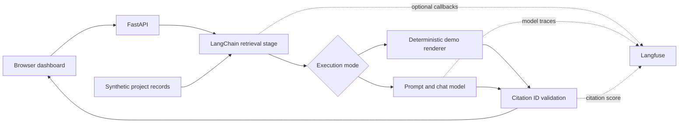

# Portfolio AI Observatory

**An evidence-backed project portfolio assistant built with LangChain, Langfuse, and FastAPI.**

Ask which projects are forecast over budget, inspect delivery risks, and trace answers back to fictional source records. This architecture demonstration connects business portfolio questions to observable AI execution.

> All projects and financial figures are synthetic. This is a portfolio demonstration, not a deployed enterprise system. Demo mode makes no model calls and must not be interpreted as AI accuracy evidence.

## What you can explore

- A responsive browser dashboard with portfolio totals, project health, questions, and source evidence.
- A LangChain pipeline with named retrieval, generation, and citation-check stages.
- Optional real model responses through `langchain-openai`.
- Optional Langfuse callbacks for traces and supported model usage/cost information, plus a citation-ID score.
- Deterministic financial calculations: **forecast minus budget**, not actual expenditure.
- Offline tests and an evaluation command that run without credentials.
- Docker packaging, GitHub Actions CI, and architecture decision records.

## Run locally

Use Python 3.11 or newer. From this repository:

```bash
python -m venv .venv
# Windows PowerShell
.venv\Scripts\Activate.ps1
# macOS/Linux: source .venv/bin/activate
python -m pip install -e ".[dev]"
python -m uvicorn observatory.api:app --host 127.0.0.1 --port 8000
```

Open **http://127.0.0.1:8000**. Interactive API documentation is at **http://127.0.0.1:8000/docs**.

Try:

- Which projects are forecast over budget?
- What are the risks and mitigations for Cedar Claims?
- Summarize project milestones.
- What is the weather? (demonstrates refusal for an unsupported topic)

The default demo renders matching records through real LangChain runnables, but does **not** use a language model. Retrieval is deliberately transparent and rule-based, not vector or semantic search. Broad portfolio questions select all four records; named-project questions select matching records.

## Enable live generation and Langfuse

Copy `.env.example` to `.env` and set:

```dotenv
APP_MODE=live
OPENAI_API_KEY=your-private-provider-key
OPENAI_MODEL=your-supported-chat-model
ENABLE_TRACING=true
LANGFUSE_PUBLIC_KEY=your-langfuse-public-key
LANGFUSE_SECRET_KEY=your-langfuse-secret-key
LANGFUSE_BASE_URL=https://cloud.langfuse.com
```

Choose the Langfuse URL matching your account region or self-hosted instance, then restart the server. Provider API usage may incur charges. Langfuse receives question text, retrieved records, and answers when enabled. Keep demonstration data synthetic; do not submit private work information.

Tracing can also be enabled in demo mode to inspect orchestration without model costs. Only live model calls supply model token usage; cost estimates depend on Langfuse's model pricing configuration. The UI reports elapsed time, not a fabricated monetary cost.

The integration lives in [`observatory/service.py`](observatory/service.py):

```python
from langfuse.langchain import CallbackHandler

handler = CallbackHandler()
result = chain.invoke(question, config={"callbacks": [handler]})
```

The application creates a new callback handler for each question, records a `citation_id_validity` score against the resulting trace, and flushes telemetry on shutdown. A passing score proves only that cited IDs exist in the retrieved records. It does not prove that the answer is factually correct.

## Architecture



See [architecture and tradeoffs](docs/architecture.md) for design decisions, trust boundaries, failure behavior, and production extensions.

## Test and evaluate

```bash
python -m pytest -q
python -m ruff check .
python -m observatory.evaluate
```

The evaluation runs fixed offline scenarios, reports pass/fail and elapsed time, and exits nonzero if a case fails. It tests source selection and abstention behavior in **demo mode**; it is not a benchmark of model reasoning or hallucination rates. Unit tests also exercise the live LangChain prompt path with a fake model, citation rejection, API validation, and tracing contracts without contacting external services.

## Docker

```bash
docker build -t portfolio-ai-observatory .
docker run --rm -p 127.0.0.1:8000:8000 portfolio-ai-observatory
# Add --env-file .env before the image name for your chosen live configuration.
```

The container runs as a non-root user. Keep access local: this demo does not implement authentication, user authorization, quotas, or a public deployment boundary.

## Repository map

```text
observatory/
  api.py                 HTTP endpoints and application lifecycle
  service.py             LangChain pipeline and Langfuse integration
  evaluate.py            Repeatable offline evaluation
  data/projects.json     Four fictional project records
  static/index.html      Browser dashboard
tests/                   Behavior and integration-contract tests
docs/architecture.md     Decisions, limitations, and production roadmap
.github/workflows/ci.yml Automated lint, tests, and evaluation
```

## Scope and limitations

- Forecast totals describe a fixed fictional snapshot, not live financial advice or an integration with a business system.
- Citation validation rejects missing or unknown project IDs, but cannot establish sentence-level grounding. A model can still attach a valid ID to a wrong claim.
- Rule-based retrieval has limited language coverage and can return more context than necessary. A production version needs retrieval evaluation and authorization filtering before generation.
- No MCP server, SSO, database, multi-user isolation, live business integration, or production deployment is claimed in this release.
- Never commit `.env`, credentials, employer code, or customer records.

## Next architectural increments

1. Add a read-only MCP adapter over authorized project records.
2. Add identity-based filtering and tests for cross-user access denial.
3. Add structured answer schemas and claim-level grounding evaluations.
4. Add a persisted evaluation dataset with human-reviewed answers in Langfuse.
5. Add deployment infrastructure, operational budgets, and rate limits.

## References

- [Langfuse's LangChain integration](https://langfuse.com/integrations/frameworks/langchain)
- [LangChain Python documentation](https://docs.langchain.com/oss/python/langchain/overview)
- [FastAPI documentation](https://fastapi.tiangolo.com/)
